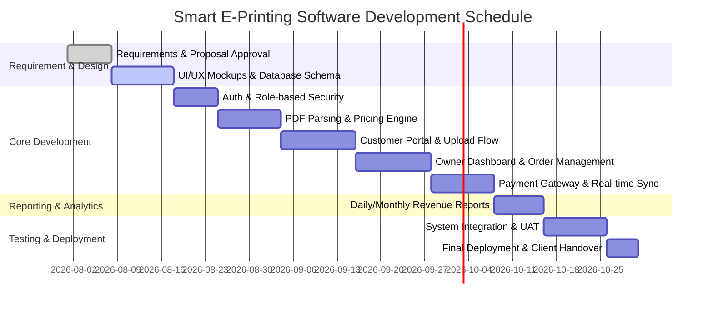

# Project Timeline & Milestones

## Project Title
**Smart E-Printing Software**

## Team Allocation
- **Prince Patel (24CS072):** Backend Architecture, PDF Parsing Engine, Database & Payment Gateway.
- **Manav Patel (24CS067):** Frontend UI/UX, Customer Portal & Real-time Order Tracking.
- **Srujal Patel (24CS076):** Admin/Owner Dashboard, Revenue Analytics & Business Reporting.

---

## 1. Project Phases & Schedule

---

## 2. Milestone Deliverables

| Milestone | Deliverables | Target Completion | Responsible |
| :--- | :--- | :--- | :--- |
| **M1: Proposal & Specs** | Project proposal, System Architecture, Repository Initialization | Week 1 | Team |
| **M2: Database & Auth** | User/Owner schemas, JWT/Session Authentication, Role guards | Week 3 | Prince Patel |
| **M3: Upload & Pricing** | PDF page count extractor, Image handler, Dynamic pricing calculator | Week 5 | Prince & Manav |
| **M4: Order & Tracking** | Order submission, Customer dashboard, Real-time status update engine | Week 7 | Manav Patel |
| **M5: Owner Dashboard** | Request management, Order accept/reject with reason, Printer queue | Week 9 | Srujal Patel |
| **M6: Payments & Reports** | Cash/Online payment integration, Revenue analytics charts & exportable reports | Week 11 | Srujal & Prince |
| **M7: Testing & Delivery** | End-to-end testing, User Acceptance Testing (UAT) with Mr. Manojbhai Patel, Deployment | Week 13 | Team |
