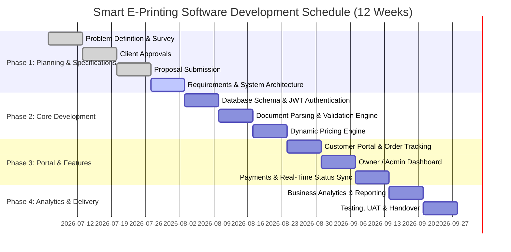

# Project Timeline & Milestones

## Project Title
**Smart E-Printing Software**

## Team Allocation
- **Prince Patel (24CS072):** Backend Architecture, PDF Parsing Engine, Database & Payment Gateway.
- **Manav Patel (24CS067):** Frontend UI/UX, Customer Portal & Real-time Order Tracking.
- **Srujal Patel (24CS076):** Admin/Owner Dashboard, Revenue Analytics & Business Reporting.

---

## 1. 12-Week Project Schedule

| Week | Dates (2026) | Theme | Primary Deliverable | Status |
| :--- | :--- | :--- | :--- | :---: |
| **1** | July 6 – July 12 | Problem Definition Selection | Problem statement identified and initial shop survey completed |✅|
| **2** | July 13 – July 19 | Approvals | Client approval & official project definition approval | ✅ |
| **3** | July 20 – July 26 | Proposal Submission | Project proposal finalized and submitted | ✅ |
| **4** | July 27 – August 2 | Requirements & System Architecture | Requirements specification, architecture design & UI/UX wireframes | ☐ |
| **5** | August 3 – August 9 | Database & Authentication | Database schema design, JWT auth & role-based access control | ☐ |
| **6** | August 10 – August 16 | Document Parsing Engine | PDF page extraction, image handler & file validation engine | ☐ |
| **7** | August 17 – August 23 | Dynamic Pricing Engine | Automated price calculation based on paper size, B&W/Color & page counts | ☐ |
| **8** | August 24 – August 30 | Customer Portal | Document upload, print customization UI & real-time order tracking | ☐ |
| **9** | August 30 – September 6 | Owner / Admin Dashboard | Request verification, accept/reject workflow with reason input & print queue | ☐ |
| **10** | September 7 – September 13 | Payments & Real-Time Sync | Cash/Online payment gateway integration & real-time status updates | ☐ |
| **11** | September 14 – September 20 | Business Analytics & Reporting | Daily/Monthly revenue dashboard & exportable print volume reports | ☐ |
| **12** | September 21 – September 27 | Testing, UAT & Handover | End-to-end testing, shop owner UAT & final system deployment | ☐ |

---

## 2. Development Schedule

---

## 3. Milestone Deliverables

| Milestone | Deliverables | Target Completion | Responsible |
| :--- | :--- | :--- | :--- |
| **M1: Proposal & Specs** | Problem statement, survey, project proposal & architecture specs | Weeks 1–4 (Jul 30) | Team |
| **M2: Core Engine & Auth** | Database schemas, JWT auth, PDF page extraction & pricing engine | Weeks 5–7 (Aug 20) | Prince Patel |
| **M3: Customer Portal** | Upload flow, print configuration & order tracking dashboard | Week 8 (Aug 27) | Manav Patel |
| **M4: Admin Dashboard** | Order verification, accept/reject queue & printer management | Week 9 (Sep 3) | Srujal Patel |
| **M5: Payments & Sync** | Cash/Online payments & WebSockets real-time status updates | Week 10 (Sep 10) | Prince & Manav |
| **M6: Business Analytics** | Daily/Monthly revenue reports & print volume analytics | Week 11 (Sep 17) | Srujal Patel |
| **M7: Testing & Delivery** | System integration, UAT with Mr. Manojbhai Patel & final deployment | Week 12 (Sep 24) | Team |
