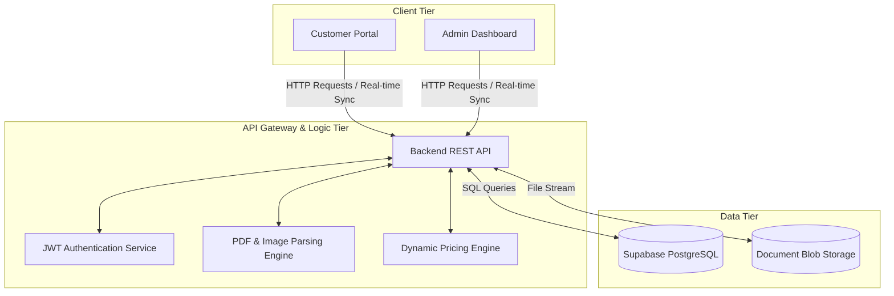
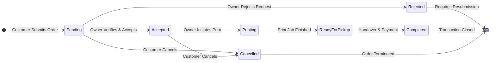
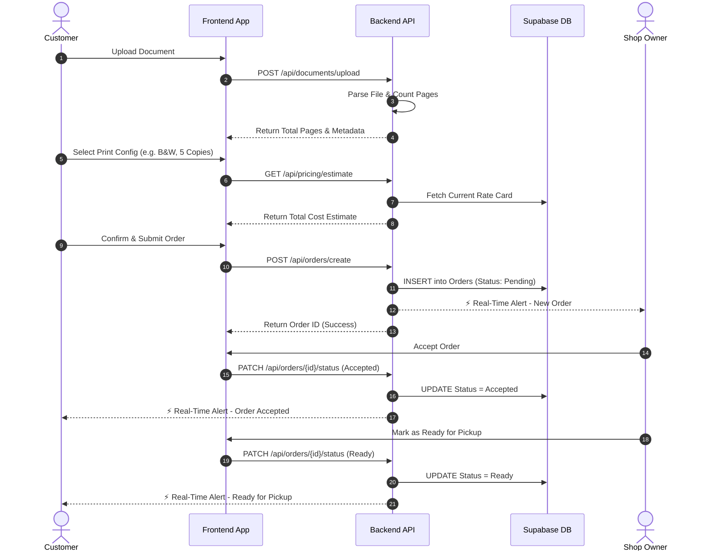

# 🖨️ Smart E-Printing Software: System Workflow & Architecture

**Document Version:** 1.0  
**Project Status:** Active Development  
**Prepared By:** Prince Patel, Manav Patel, Srujal Patel  
**Client:** Umiya Graphics and Printing  

---

## 📑 Table of Contents
1. [Introduction & Scope](#1-introduction--scope)
2. [High-Level System Architecture](#2-high-level-system-architecture)
3. [Core Business Workflows](#3-core-business-workflows)
   - [UC-01: Customer Onboarding & Authentication](#uc-01-customer-onboarding--authentication)
   - [UC-02: Print Order Submission (Customer)](#uc-02-print-order-submission-customer)
   - [UC-03: Order Processing & Fulfillment (Owner)](#uc-03-order-processing--fulfillment-owner)
4. [Order State Lifecycle](#4-order-state-lifecycle)
5. [Detailed Data Flow Sequence](#5-detailed-data-flow-sequence)
6. [Exception & Edge Case Handling](#6-exception--edge-case-handling)

---

## 1. Introduction & Scope
This document outlines the end-to-end technical and operational workflows for the **Smart E-Printing Software**. Designed to industry standards, it serves as the primary reference for developers, QA engineers, and stakeholders to understand system architecture, state transitions, data flow, and actor responsibilities.

---

## 2. High-Level System Architecture
The platform follows a modern client-server architecture. It utilizes a lightweight Frontend communicating via REST API with a secure Backend, backed by a robust Cloud Database.

---

## 3. Core Business Workflows

### UC-01: Customer Onboarding & Authentication
1. **Action:** Customer visits the web platform.
2. **Process:** 
   - New users submit the Registration form (Name, Email, Password).
   - Backend creates a record in the `Users` table and securely hashes the password.
   - For Login, Backend validates credentials and issues a secure `JWT` (JSON Web Token).
3. **Outcome:** User is authenticated and granted access to the Customer Portal.

### UC-02: Print Order Submission (Customer)
1. **Upload Phase:** Customer uploads a document (`.pdf`, `.png`, `.jpg`).
2. **Analysis Phase:** Backend validates the mime-type, temporarily stores the file, and executes the parsing engine to extract the exact total page count.
3. **Configuration Phase:** Customer selects print preferences (B&W vs. Color, Number of Copies, Specific Page Ranges).
4. **Estimation Phase:** The Pricing Engine calculates the total cost based dynamically on the Owner's live Rate Card.
5. **Commitment Phase:** Customer confirms the order. The order is committed to the database in a `Pending` state.

### UC-03: Order Processing & Fulfillment (Owner)
1. **Notification:** Owner receives a live alert (via WebSockets/SSE) of a new `Pending` order on their dashboard.
2. **Review:** Owner previews the document and verifies print integrity.
3. **Decision:** 
   - **Accept:** Moves order to the `Printing` queue.
   - **Reject:** Owner inputs a required rejection reason (e.g., "Corrupted File"); order terminates.
4. **Fulfillment:** Owner physically prints the document and marks the system status as `Ready for Pickup`.
5. **Completion:** Customer physically collects the print, completes payment (if cash), and the Owner marks the transaction as `Completed`.

---

## 4. Order State Lifecycle
*The exact state machine governing every print job in the system, ensuring data consistency.*

---

## 5. Detailed Data Flow Sequence
*A granular sequence diagram representing the technical data exchange from Submission (UC-02) to Fulfillment (UC-03).*

---

## 6. Exception & Edge Case Handling

To ensure robust industry-level operations, the system is designed to gracefully handle the following edge cases:

| Scenario | System Behavior / Resolution |
| :--- | :--- |
| **Corrupted File Upload** | Parsing Engine catches error during validation; rejects upload immediately and prompts Customer to re-upload. |
| **Customer Cancels Order** | Customer can cancel only if the status is `Pending` or `Accepted`. Once moved to `Printing`, cancellation is disabled to prevent material loss for the shop. |
| **Order Abandonment** | If an order sits in `ReadyForPickup` for >48 hours, the Owner dashboard flags it in red. The Owner can manually transition it to `Abandoned` to maintain accurate revenue analytics. |
| **Rate Card Update** | If the Owner changes pricing rates while a customer is configuring an order, the system locks in the price at the exact moment of order submission to prevent discrepancies. |
| **Large File Uploads** | Files exceeding 20MB are handled via chunked or streaming uploads to avoid request timeouts, ensuring stable transfers over slow networks. |
